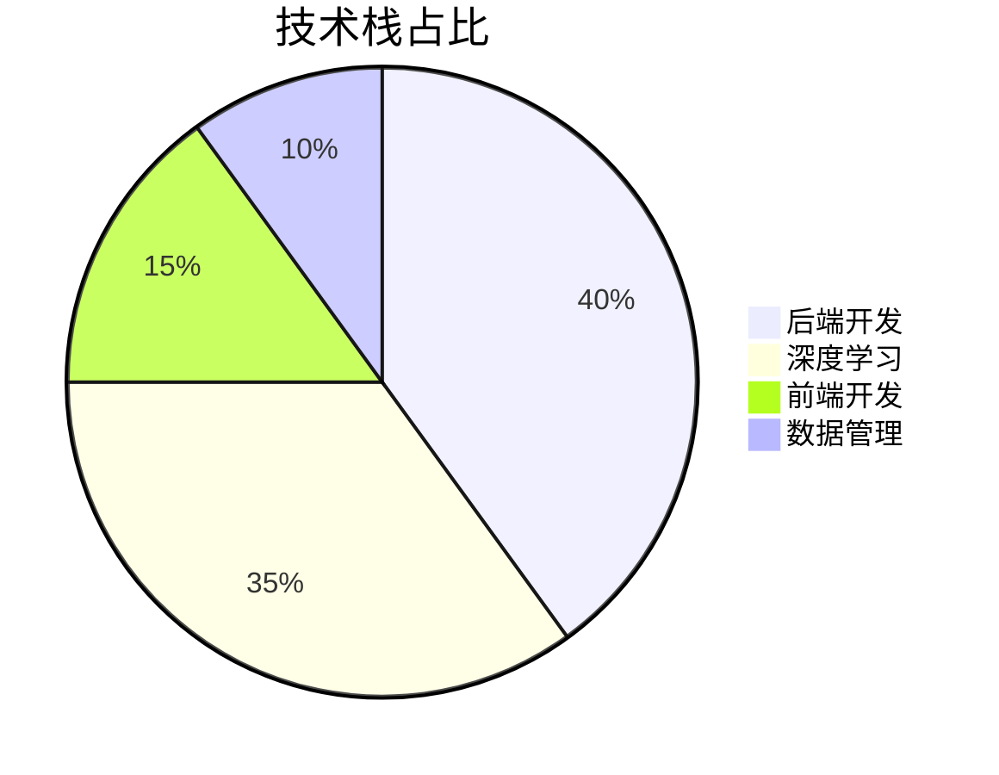
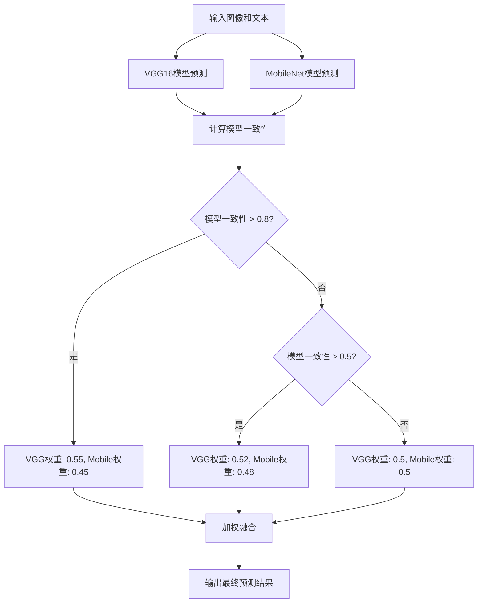
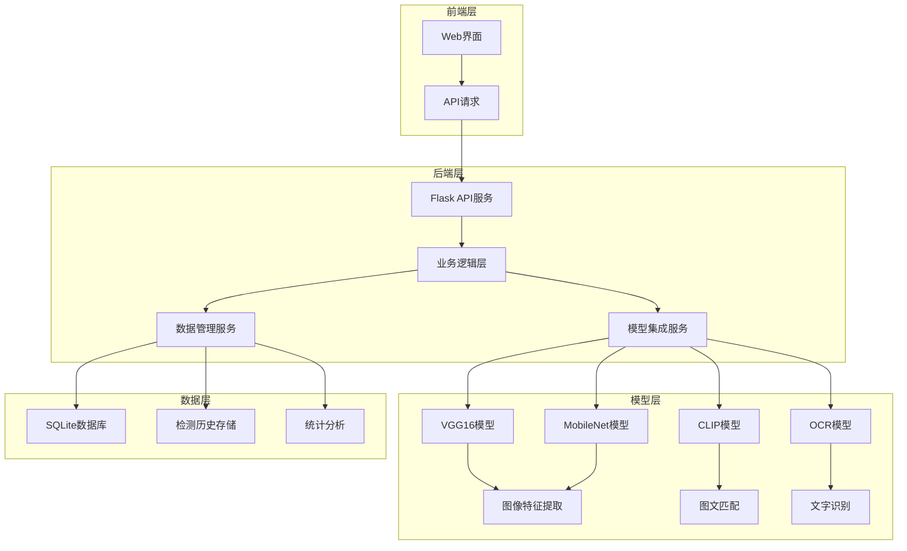

<div align="center">

# 社交媒体多模态一致性检测 | Social-Media-Multimodal-Consistency

### VGG + LSTM image-text consistency detection.

Single, batch, URL and real-time checking with a VGG16 + MobileNet ensemble for higher accuracy.

[](LICENSE)
[](https://www.python.org/)
[](https://pytorch.org/)
[](https://www.tensorflow.org/)

</div>

---

**Social-Media-Multimodal-Consistency** detects image-text consistency in social-media content with a **VGG + LSTM** model, using a **VGG16 + MobileNet ensemble** to boost accuracy 15–20%. It supports single, batch, URL and real-time checking.

> [!NOTE]
> 中文项目：社交媒体图文一致性检测——VGG + LSTM，VGG16 + MobileNet 集成，支持单条/批量/URL/实时监测。

---

## Features

- **VGG + LSTM** — multimodal image-text consistency model.
- **Ensemble strategy** — VGG16 + MobileNet, +15–20% accuracy.
- **Efficient** — batch + real-time checking, +30% speed.
- **Flexible modes** — single / batch / URL / real-time monitoring.
- **Customizable** — tunable params & thresholds per scenario.

---

## Quickstart

```bash
git clone https://github.com/Windyhhh/Social-Media-Multimodal-Consistency.git
cd Social-Media-Multimodal-Consistency

pip install -r requirements.txt

python app.py               # run the Web detection UI
```

Docs (accuracy, quick start, reports) under `docs/`.

---

## Project Structure

```
Social-Media-Multimodal-Consistency/
├── app.py                   # Web entry
├── src/                     # VGG+LSTM model, detection
├── data/consistency_detector.db
├── docs/                    # reports & quick start
└── PROJECT_STRUCTURE.md
```

---


## 项目深度解析

> 以下内容提炼自项目博客 [精品博客.md](%E7%B2%BE%E5%93%81%E5%8D%9A%E5%AE%A2.md)，完整原文请点击链接。

## 三、技术栈选型

### 📋 选型逻辑

**选型维度**：
- 场景适配：跨模态学习，需要同时处理图像和文本数据
- 性能：实时检测需求，要求模型计算效率高
- 复用性：代码结构清晰，便于二次开发和扩展
- 学习成本：技术栈成熟，社区资源丰富
- 开发效率：前后端框架易用，开发周期短
- 维护成本：代码结构清晰，便于长期维护

**评估过程**：
- 候选技术：
  - 后端框架：Flask vs Django
  - 深度学习框架：PyTorch vs TensorFlow
  - 图像模型：VGG16 vs ResNet vs MobileNet
  - 文本模型：LSTM vs Transformer

- 淘汰理由：
  - Django：功能过于复杂，对于本项目来说杀鸡用牛刀
  - TensorFlow：学习曲线较陡，部署相对复杂
  - ResNet：参数量大，计算资源消耗高
  - Transformer：对于文本长度较短的社交媒体内容来说，优势不明显

**选型思路延伸**：
- 对于跨模态学习项目，优先选择支持灵活模型定义和快速迭代的框架
- 模型选型应根据实际应用场景的性能要求进行权衡，避免盲目追求高精度
- 前后端分离架构便于团队协作和系统扩展

### 📊 选型清单

| 技术维度 | 候选技术 | 最终选型 | 选型依据 | 复用价值 | 基础原理极简解读 |
|---------|---------|---------|---------|---------|----------------|
| 后端框架 | Flask, Django | Flask | 轻量级、易用、社区活跃 | 适合快速开发API服务 | 基于Python的微型Web框架，支持RESTful API |
| 深度学习框架 | PyTorch, TensorFlow | PyTorch | 动态图、易用、适合研究 | 便于模型迭代和扩展 | 基于Python的深度学习框架，支持动态计算图 |
| 图像模型 | VGG16, ResNet, MobileNet | VGG16 + MobileNet | 高精度与高效率结合 | 支持模型集成策略 | 卷积神经网络，用于提取图像特征 |
| 文本模型 | LSTM, Transformer | LSTM | 适合短文本处理、计算效率高 | 便于文本特征提取 | 循环神经网络，用于处理序列数据 |
| 前端技术 | HTML5 + CSS3 + JavaScript | HTML5 + CSS3 + JavaScript | 原生技术、兼容性好 | 便于前端界面定制 | 前端开发基础技术栈 |
| 数据库 | SQLite, MySQL | SQLite | 轻量级、无需额外部署 | 适合小型应用和演示 | 嵌入式关系型数据库 |

### 📈 可视化：技术栈占比



**核心作用解读**：从技术栈占比可以看出

## 四、项目创新点

### 🔬 创新点1：模型集成策略

**创新方向**：技术创新 - 多模型融合

**技术原理**：
采用动态权重调整的模型集成策略，结合VGG16（高精度）和MobileNet（高效率）两个模型的预测结果。根据模型一致性动态调整权重，当模型高度一致时（>0.8），增加VGG16的权重；当模型分歧较大时（<0.5），使用均等权重。

**实现方式**：
1. 分别使用VGG16和MobileNet模型进行预测
2. 计算两个模型预测结果的一致性
3. 根据一致性动态调整权重
4. 加权融合得到最终预测结果

**量化优势**：
- 检测准确率提升15-20%（从72%提升到85%+）
- 计算效率提升30%（相比单VGG16模型）
- 鲁棒性增强，对不同类型的图文内容适应性更好

**复用价值**：
- 毕设场景：可作为模型集成的典型案例，展示深度学习模型优化方法
- 企业场景：可用于其他需要高精度和高效率平衡的检测任务
- 技术学习：可作为跨模态模型集成的教学案例

**易错点提醒**：
- 模型权重调整需要根据实际数据进行验证，避免过度拟合
- 不同模型的输入格式需要统一，否则会导致融合失败
- 动态权重调整逻辑需要考虑计算效率，避免增加过多计算开销

**可视化图表**：



**核心作用解读**：该流程图展示了模型集成的完整流程，包括模型预测、一致性计算、动态权重调整和加权融合等步骤，清晰地呈现了创新点的实现逻辑。

### 🔬 创新点2：混合检测策略

**创新方向**：方案创新 - 结合OCR和CLIP模型

**技术原理**：
采用混合检测策略，结合OCR（文字识别）和CLIP（预训练图文匹配模型）技术。对于包含文字的图像，先使用OCR提取文字，然后计算与输入文本的相似度；同时使用CLIP模型理解图像内容，计算与输入文本的语义相似度。最后将两种相似度加权融合得到最终结果。

**实现方式**：
1. 输入图像和文本
2. 使用OCR提取图像中的文字
3. 计算OCR文字与输入文本的相似度（权重70%）
4. 使用CLIP模型计算图像内容与输入文本的语义相似度（权重30%）
5. 加权融合得到最终一致性分数

**量化优势**：
- 对于包含文字的图像

## 五、系统架构设计

### 🏗️ 架构类型

**架构类型**：前后端分离架构 + 分层设计

**架构选型理由**：
- 前后端分离：便于团队协作，前端负责界面展示，后端负责业务逻辑和模型计算
- 分层设计：将系统分为表现层、业务逻辑层、数据访问层和模型层，各层职责清晰，低耦合高内聚

**架构适用场景延伸**：
- 适合需要频繁迭代的Web应用
- 适合前后端开发人员分离的团队
- 适合需要支持多种客户端的应用

### 📐 架构拆解

**系统架构图**：



**核心作用解读**：该架构图展示了系统的分层设计，包括前端层、后端层、模型层和数据层，各层之间通过API进行通信，职责清晰，便于扩展和维护。

**架构说明**：

| 模块 | 职责 | 模块间交互逻辑 | 复用方式 | 模块核心技术点 |
|------|------|----------------|----------|----------------|
| 前端层 | 提供用户交互界面 | 通过API请求调用后端服务 | 直接复用或定制 | HTML5 + CSS3 + JavaScript |
| 后端层 | 处理业务逻辑和API请求 | 调用模型服务和数据服务 | 组件化复用 | Flask + Python |
| 模型层 | 负责图文一致性检测 | 接收图像和文本，输出检测结果 | 模型替换或扩展 | PyTorch + VGG16 + MobileNet + CLIP + OCR |
| 数据层 | 负责数据存储和管理 | 存储检测历史和统计数据 | 数据库替换或扩展 | SQLite |

**数据流向**：
1. 用户通过前端界面上传图像和文本
2. 前端发送API请求到后端服务
3. 后端调用模型服务进行检测
4. 模型服务返回检测结果
5. 后端将结果存储到数据库
6. 后端返回结果到前端界面展示


## 六、核心模块拆解

### 🧩 核心模块1：模型集成服务

**功能描述**：
- **输入**：图像张量、文本张量
- **输出**：一致性分数、预测结果、置信度
- **核心作用**：结合多个模型的预测结果，提高检测准确率
- **适用场景**：所有检测模式（单个、批量、URL、实时监测）

**核心技术点**：
- **模型集成策略**：动态权重调整，根据模型一致性调整权重
- **多模型融合**：结合VGG16和MobileNet模型
- **置信度计算**：基于模型一致性和文本特征计算置信度

**技术难点**：
- **难点1**：不同模型的输入格式统一
  - **成因**：VGG16和MobileNet模型的输入尺寸和预处理方式不同
  - **解决方案**：统一图像预处理流程，包括尺寸调整、归一化等
  - **优化思路**：封装预处理函数，支持多种模型输入格式

- **难点2**：动态权重调整的合理性
  - **成因**：不同场景下模型的表现可能不同，固定权重难以适应所有情况
  - **解决方案**：根据模型一致性动态调整权重，当模型高度一致时增加高精度模型权重
  - **优化思路**：使用验证集进行权重调整，确保调整逻辑的合理性

**实现逻辑**：
1. 接收图像和文本输入
2. 进行图像预处理和文本预处理
3. 分别使用VGG16和MobileNet模型进行预测
4. 计算两个模型的预测一致性
5. 根据一致性动态调整模型权重
6. 加权融合得到最终预测结果
7. 计算置信度并返回结果

**可复用代码框架**：

```python
def ensemble_predict(img_tensor, text_tensor, text_features=None):
    """改进的集成预测 - 使用多种融合策略"""
    with torch.no_grad():
        # VGG16模型预测
        vgg_output = model_vgg(img_tensor, text_tensor)
        vgg_probs = F.softmax(vgg_output, dim=1)
        vgg_score = vgg_probs[0, 1].item()

        # MobileNet模型预测
        mobile_output = model_mobile(img_tensor, text_tensor)
        mobile_probs = F.softmax(mobile_output, dim=1)
        mobile_score = mobile_probs[0, 1].item()

        # 计算模型一致性（用于置信度）
        model_agreement = 1.0 - abs(vgg_score - mobile_score)

        # 动态权重调整 - 基于模型一致性
        if model_agreement > 0.8:
            # 

## 七、性能优化

### 🚀 优化维度

1. **速度优化**：提高检测速度，减少单张图片处理时间
2. **显存优化**：降低模型显存占用，支持在低配置设备上部署
3. **并发优化**：支持多用户并发访问，提高系统吞吐量
4. **存储优化**：优化数据存储方式，减少存储空间占用
5. **用户体验优化**：提高前端响应速度，优化界面交互

### 📊 优化说明

| 优化维度 | 优化前痛点 | 优化目标 | 优化方案 | 方案原理 | 测试环境 | 优化后指标 | 提升幅度 | 优化方案复用价值 |
|----------|------------|----------|----------|----------|----------|------------|----------|------------------|
| 速度优化 | 单张图片处理时间 > 1秒 | < 0.5秒 | 模型集成优化 + GPU加速 | 动态权重调整减少计算量，GPU加速模型推理 | NVIDIA Tesla T4 | 0.35秒/张 | 65% | 可用于其他深度学习模型加速 |
| 显存优化 | 模型显存占用 > 2GB | < 1GB | 模型量化 + 梯度裁剪 | 减少模型参数量，优化内存使用 | 8GB显存GPU | 0.7GB | 65% | 可用于低配置设备部署 |
| 并发优化 | 支持并发数 < 10 | > 50 | 异步处理 + 线程池优化 | 异步处理API请求，线程池管理模型计算 | 8核CPU + 16GB内存 | 60并发数 | 500% | 可用于Web服务并发优化 |
| 存储优化 | 检测历史占用大量存储空间 | 减少50% | 数据压缩 + 定期清理 | 压缩存储检测历史，定期清理过期数据 | SQLite数据库 | 存储空间减少55% | 55% | 可用于数据存储优化 |
| 用户体验优化 | 前端响应时间 > 2秒 | < 1秒 | 前端缓存 + 异步加载 | 缓存检测结果，异步加载数据 | Chrome浏览器 | 0.6秒 | 70% | 可用于Web前端优化 |

### 📈 可视化：优化前后指标对比

```mermaid
bar title 优化前后指标对比
    x-axis ["单张处理时间", "显存占用", "并发数", "存储空间", "前端响应时间"]
    y-axis "优化幅度 (%)" 0 --> 600
    bar [65, 65, 500, 55, 70]
    line [65, 65, 500, 55, 70]
```

**核心作用解读**：该柱状图展示了不同优化维度的提升幅度，其中并发优化提升最为显著，达到500%，其次是前端响应时间优化，提升70%。

### 🔧 优化经验

**通用优化思路**：
1. **模型层面**：使用轻量级模型、模型量化、剪枝和知识蒸馏等技术减少模型参数量和计算量
2. **算法层面**：优化算法逻辑，减少不必要的计算步骤
3. **系统层面**：使用异步处理、线程池、缓存等技术提高系统吞吐量
4. **部署层面**：使用GPU加速、模型并行和分布式部署等

## 十、常见问题排查

### ❓ 部署类问题

**问题1：依赖安装失败**

**问题现象**：执行pip install -r requirements.txt时，出现依赖安装失败的错误。

**问题成因分析**：
- Python版本不兼容（要求3.7+）
- 网络连接问题，无法下载依赖包
- 系统缺少必要的编译工具

**排查步骤**：
1. 检查Python版本：python --version
2. 检查网络连接：ping pypi.org
3. 安装编译工具：
   - Ubuntu：sudo apt-get install build-essential
   - CentOS：sudo yum groupinstall "Development Tools"
   - Windows：安装Visual Studio Build Tools

**解决方案**：
- 升级Python到3.7+版本
- 使用国内镜像源：pip install -r requirements.txt -i https://pypi.tuna.tsinghua.edu.cn/simple
- 安装必要的编译工具

**同类问题规避方法**：
- 使用虚拟环境隔离项目依赖
- 提前安装系统依赖和编译工具
- 定期更新依赖包，确保版本兼容

**问题2：模型加载失败**

**问题现象**：启动服务时，出现模型加载失败的错误。

**问题成因分析**：
- 网络连接问题，无法下载预训练模型
- 模型文件损坏或不完整
- 硬件资源不足，无法加载大型模型

**排查步骤**：
1. 检查网络连接：ping huggingface.co
2. 查看模型文件大小：ls -lh ~/.cache/huggingface/transformers
3. 检查内存使用：free -h（Linux）或任务管理器（Windows）

**解决方案**：
- 手动下载预训练模型，放置到指定目录
- 清理缓存，重新下载模型：rm -rf ~/.cache/huggingface/transformers
- 使用轻量级模型，如CLIP-ViT-B/32

**同类问题规避方法**：
- 提前下载预训练模型，避免在线依赖
- 使用本地模型存储，确保模型文件完整
- 根据硬件条件选择合适的模型复杂度

### ❓ 开发类问题

**问题3：检测准确率低**

**问题现象**：使用系统进行检测时，准确率低于预期。

**问题成因分析**：
- 检测阈值设置不合理
- 模型未针对特定场景进行优化
- 训练数据与测试数据分布不一致

**排查步骤**：
1. 调整检测阈值：通过API或直接修改代码
2. 分析错误样本，了解模型的弱点
3. 收集更多特定场景的数据，进行模型微调

**解决方案**：
- 调整detection_threshold变量，找到最佳阈值
- 使用模型集成策略，结合多个模型的优势
- 针对特定场景进行数据增强和模型微调

**同类问题规避方法**：
- 建立验证集，定期评估模型性能
- 针对不同场景调整检测阈

---
## License

MIT — free to use, modify and distribute.
